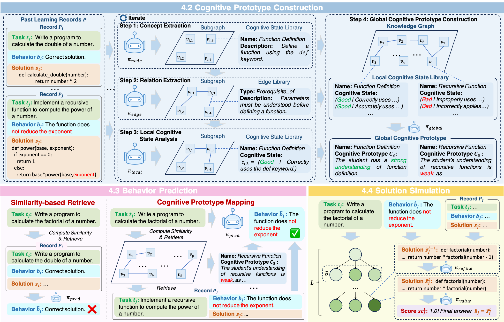

## Embracing Imperfection: Simulating Students with Diverse Cognitive Levels Using LLM-based Agents

This is the anonymous official repository of the ARR February 25 submission "Embracing Imperfection: Simulating Students with Diverse Cognitive Levels Using LLM-based Agents".



### Getting Started

#### 1. Installation

Git clone our repository and creating conda environment:

```python
conda create -n student python=3.8
conda activate student
pip install -r requirements.txt
```

#### 2. Prepare Your API Key

Prepare you openai api key into the environment:

```
export OPENAI_API_KEY="your key"
```

#### 3. Run the code

```
python test.py
```

